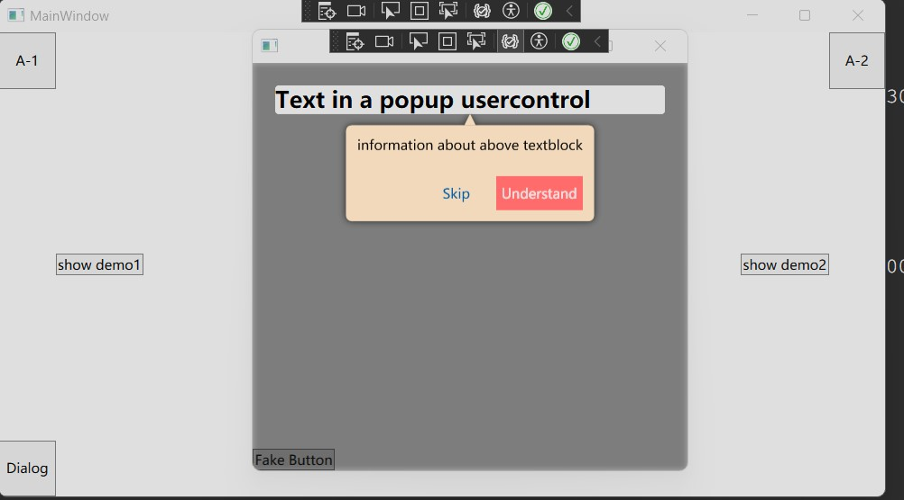

This is a WPF control encapsulation designed for Beginner's Guidance, aiming to provide a user-friendly interface that can be applied in various introductory scenarios. The entire codebase is developed using .NET 8 and WPF. It includes three demos, ranging from simple to complex usage of the control, which interested individuals can download and experiment with on their own.

I will first provide an overview of how to use this control and the design idea, followed by an explanation of how the three demos work. I hope this can inspire those developing with WPF and also serve as part of my learning process. If you find the initial section on `Control Encapsulation Introduction` is difficult to understand, I recommend going directly to the demo section. And if you find yourself confused about some features in demos, revisiting the `Control Encapsulation Introduction` when encountering difficulties in the demos might be more efficient.

# Control Encapsulation Introduction
The entire beginner's guide control is encapsulated within the FreshGuidance assembly, primarily encompassing the following aspects:
## GuideMask
This control serves as the overlay for the entire beginner's guide, covering all controls that need to be highlighted in the tutorial. It is typically placed within a Grid and set with the maximum values for Grid.RowSpan and Grid.ColumnSpan to cover the entire page intended to be obscured. The below area in the red rectangle is the area of GuideMask.

## GuideMaskWrapper
GuideMaskWrapper is a wrapper class for GuideMask. This class is necessary because GuideMask is instantiated via a function `static public GuideMask GuideMaskFactory(string key)`, where a key is passed to return a specific instance of GuideMask linked to that key (if the keys are the same, the same GuideMask instance is returned). However, directly invoking `<GuideMask/>` in XAML would create a new instance every time, which does not adhere to the aforementioned functionality. Therefore, GuideMaskWrapper is used to ensure its content is a GuideMask for a specific key. This approach is particularly important for scenarios involving nested XAML calls, like the following example, where guides need to be displayed in both a `Button` and a `Local:UserControl1`; using a key ensures both elements share the same GuideMask instance. But for user's eyes, the area of `GuideMaskWrapper` is the same as the `GuideMask`. If the explanation here is hard to follow, don’t worry,its usage will be elaborated in the third demo.
``` xml
<Window x:Class="GuideMixUsageDemo.MainWindow"
        xmlns="http://schemas.microsoft.com/winfx/2006/xaml/presentation"
        xmlns:x="http://schemas.microsoft.com/winfx/2006/xaml"
        xmlns:d="http://schemas.microsoft.com/expression/blend/2008"
        xmlns:mc="http://schemas.openxmlformats.org/markup-compatibility/2006"
        xmlns:fg="clr-namespace:FreshGuidance;assembly=FreshGuidance"
        xmlns:local="clr-namespace:GuideMixUsageDemo"
        mc:Ignorable="d"
        Title="MainWindow" Height="450" Width="800">
    <Grid>
        <Grid.RowDefinitions>
            <RowDefinition Height="auto"></RowDefinition>
            <RowDefinition Height="auto"></RowDefinition>
        </Grid.RowDefinitions>
        <Grid.ColumnDefinitions>
            <ColumnDefinition Width="auto"></ColumnDefinition>
            <ColumnDefinition Width="auto"></ColumnDefinition>
        </Grid.ColumnDefinitions>
        <Button Content="A-1" Width="50" Height="50" 
            Grid.Row="0"
            Grid.Column="0"/>
        <local:UserControl1 
            Grid.Row="1" 
            Grid.Column="1" 
             Width="200" Height="200" 
            x:Name="UserControl1">
        </local:UserControl1>
    </Grid>
</Window>
```

## HintControls
The folder `HintControls` contains sub-controls used in the beginner's guide to provide hints, divided into `GuideClickHintControl` and `GuideTipHintControl`.

### GuideClickHintControl
This control adds guidance on a target control to direct user interaction with the target, thereby triggering the target control's functionality and move the guide to the next level. The following picture shows the area of `GuideClickHintControl` in red rectangle, including the blue cricle guiding user to click the button and the mouse picture guiding user to click mouse left button.


### GuideTipHintControl
This control adds guidance on a target control to draw the user's attention to it and provides related hint information. Users can move to the next level of the guide by clicking the `Understand` button. The following picture shows the area of `GuideTipHintControl` in red rectangle.


## HelpClasses
The `HelpClasses` folder contains auxiliary classes that assist with binding target controls, acquiring GuideMasks, and other functions.

### EnumToVisibilityConverter
This class implements `IValueConverter` interface and is used to convert enumeration values into visibility. It is primarily used within the ControlTemplate of `GuideClickHintControl` and `GuideTipHintControl` to toggle the visibility of small directional triangles. This detail may be overlooked without looking at the source code. If you want to look into details, you can check `GuideClickHintControlStyle.xaml` and `GuideTipHintControlStyle.xaml` in `/FreshGuidance/Theme/Styles` directory.

### GetGuideMaskExtension
This class inherits from `MarkupExtension`, and its `ProvideValue` method returns a GuideMask associated with a key by passing in the key. It is used in GuideMaskWrapper to help obtain the GuideMask corresponding to the specified key. The usage is like below, where `fg` is `xmlns:fg="clr-namespace:FreshGuidance;assembly=FreshGuidance"`.
```xml
<fg:GuideMaskWrapper Name="wrapper"
                 Grid.Row="0"
                 Grid.Column="0"
                 Grid.RowSpan="5"
                 Grid.ColumnSpan="5"
                 Content="{fg:GetGuideMask SOME_SPECIFIC_KEY}">
</fg:GuideMaskWrapper>
```

### GuideMaskHelper
This class is a `DependencyObject` and includes an AttachedProperty `HelpBindTargetControl`. This attached property requires a string value, but the actual value isn't as significant. Its primary use is to be applied as an attached property on target controls. Through this mechanism, one can access the target control and some of its related properties.

### SetupGuideMaskContextExtension
This class inherits from `MarkupExtension`. Its `ProvideValue` method returns `string.Empty`, which is primarily used with the attached property `HelpBindTargetControl` of `GuideMaskHelper`. The return value itself is not important; the significance lies in using the attached property to gather information about the desired target controls, such as the control itself, the method that invokes the control, the order of appearance of the guide controls, etc. This concept might be difficult to grasp here but will be detailed in subsequent examples. the usage is like below, where `fg` is `xmlns:fg="clr-namespace:FreshGuidance;assembly=FreshGuidance"`.
```xml
<Button Grid.Row="0" Content="TEST" Width="50" Height="50">
    <fg:GuideMaskHelper.HelpBindTargetControl>
        <fg:SetupGuideMaskContext
                GuideMaskKey="FIRST"                     
                HintControlIndex="0">
            <fg:SetupGuideMaskContext.HintControl>
                <fg:GuideTipHintControl 
                        Background="Bisque"
                        Placement="BOTTOM">
                    <TextBlock Text="Test text test text"/>
                </fg:GuideTipHintControl>
            </fg:SetupGuideMaskContext.HintControl>
        </fg:SetupGuideMaskContext>
    </fg:GuideMaskHelper.HelpBindTargetControl>
</Button>
```
The code snippet above uses `fg:GuideMaskHelper.HelpBindTargetControl` attached property to `Button` and by using `fg:SetupGuideMaskContext` MarkupExtension to set up the `GuideMaskKey`, `HintControlIndex`, and `HintControl` properties. Also `fg:SetupGuideMaskContext` MarkupExtension can get the target control which is `Button`.

# Demo Introduction
There are three demos for showing how to use Beginner's Guidance Assembly.
## GuideTipHintControlDemo
This is the simplest demo. Its main function is to display hint messages on the page. When the user clicks `Understand`, they are guided to the next hint message.

```xml
<Window x:Class="GuideTipHintControlDemo.MainWindow"
        xmlns="http://schemas.microsoft.com/winfx/2006/xaml/presentation"
        xmlns:x="http://schemas.microsoft.com/winfx/2006/xaml"
        xmlns:d="http://schemas.microsoft.com/expression/blend/2008"
        xmlns:mc="http://schemas.openxmlformats.org/markup-compatibility/2006"
        xmlns:fg="clr-namespace:FreshGuidance;assembly=FreshGuidance"
        mc:Ignorable="d"
        Title="MainWindow" Height="450" Width="800">
    <Grid>
        <Grid.RowDefinitions>
            <RowDefinition Height="auto"></RowDefinition>
            <RowDefinition Height="*"></RowDefinition>
            <RowDefinition Height="auto"></RowDefinition>
            <RowDefinition Height="*"></RowDefinition>
            <RowDefinition Height="auto"></RowDefinition>
        </Grid.RowDefinitions>
        <Grid.ColumnDefinitions>
            <ColumnDefinition Width="auto"></ColumnDefinition>
            <ColumnDefinition Width="*"></ColumnDefinition>
            <ColumnDefinition Width="auto"></ColumnDefinition>
            <ColumnDefinition Width="*"></ColumnDefinition>
            <ColumnDefinition Width="auto"></ColumnDefinition>
        </Grid.ColumnDefinitions>
        <Button Grid.Row="0" Content="TEST 0" Background="Orange" Width="50" Height="50">
        </Button>

        <Button Grid.Row="0" Grid.Column="2" Content="TEST 1" Background="Orange" Width="50" Height="50">
        </Button>

        <Button Grid.Row="0" Grid.Column="4" Content="TEST 2" Background="Orange" Width="50" Height="50">
        </Button>

        <Button Grid.Row="2" Grid.Column="0" Content="TEST 3" Background="Orange" Width="50" Height="50">
        </Button>

        <Button Grid.Row="2" Grid.Column="2" Click="Button_Click">Show guide tips</Button>

        <Button Grid.Row="2" Grid.Column="4" Content="TEST 4" Background="Orange" Width="50" Height="50">
        </Button>

        <Button Grid.Row="4" Grid.Column="0" Content="TEST 5" Background="Orange" Width="50" Height="50">
        </Button>

        <Button Grid.Row="4" Grid.Column="2" Content="TEST 6" Background="Orange" Width="50" Height="50">
        </Button>

        <Button Grid.Row="4" Grid.Column="4" Content="TEST 7" Background="Orange" Width="50" Height="50">
        </Button>
        <fg:GuideMaskWrapper Name="wrapper"
                         Grid.Row="0"
                         Grid.Column="0"
                         Grid.RowSpan="5"
                         Grid.ColumnSpan="5"
                         Content="{fg:GetGuideMask FIRST, GuideMaskBackGroundBrush=#53000000}">
        </fg:GuideMaskWrapper>
    </Grid>
</Window>
```
First, we construct a UI interface similar to the one described above, consisting of numerous buttons laid out in a grid. The appearance of this UI interface is as follows.

We aim to overlay our beginner's guide UI across the entire grid, so we create `fg:GuideMaskWrapper` and set its Grid.RowSpan and Grid.ColumnSpan to the maximum to ensure it covers the entire grid. The content of the wrapper is returned by `fg:GetGuideMask`, to which we pass the value (i.e., the GuideMask's Key) "FIRST".

Then, we add the following code to each button:
```xml
<Button Grid.Row="0" Content="TEST 0" Background="Orange" Width="50" Height="50">
    <fg:GuideMaskHelper.HelpBindTargetControl>
        <fg:SetupGuideMaskContext GuideMaskKey="FIRST" HintControlIndex="0">
            <fg:SetupGuideMaskContext.HintControl>
                <fg:GuideTipHintControl Background="Bisque" Placement="BOTTOM">
                    <TextBlock Text="Test text test text"/>
                </fg:GuideTipHintControl>
            </fg:SetupGuideMaskContext.HintControl>
        </fg:SetupGuideMaskContext>
    </fg:GuideMaskHelper.HelpBindTargetControl>
</Button>
```

The code above uses the `fg:GuideMaskHelper.HelpBindTargetControl` attached property to retrieve information about a Button. The value of this attached property is then returned by `fg:SetupGuideMaskContext`, which at this point only returns a "string.Empty". However, the actual functionality comes from the ProvideValue function within `fg:SetupGuideMaskContext`. This function retrieves a `GuideMask` with the key 'FIRST' from GuideMaskKey—essentially, the one previously bound to the Grid. It then adds an `fg:GuideTipHintControl` to this `GuideMask` and sets the `Button` as the TargetControl for the `fg:GuideTipHintControl`. Thus, the `fg:GuideTipHintControl` ultimately points to this Button when displayed. There are two points to note here. First, `HintControlIndex` indicates the order of appearance of `GuideTipHintControl`, which doesn't have to follow the sequence "0,1,2,3..." but must be in ascending integer order, such as "0,3,19". Second, the `Placement` property is an enumeration that specifies the position of the `GuideTipHintControl` relative to the TargetControl.

Finally, this code structure is added to all Buttons, with careful attention to the sequence of `HintControlIndex`. Additionally, an event like below is attached to the middle Button that, when clicked, displays the guide.
```C#
private void Button_Click(object sender, RoutedEventArgs e)
{
    (wrapper.Content as GuideMask).Show();
}
```

## GuideClickHintControlDemo
this demo is almost the same with the first demo, except that in this demo, the TargetControl can be clicked by the user. So, as a result, after the user clicked the TargetControl, the TargetControl's click event raised and also the `GuideMask`'s click event also be raised, which leads to the `GuideMask` shows the next `GuideClickHintControl`.

The difference of this demo is that `fg:SetupGuideMaskContext` needs to add `EventName` property, which needs to be the name of the Target Control's raised event when user clickes the left mouse button. In below code snippet, we wish when user clicks Button, which means the Button's Click event is raised, `GuideMask` move the beginner's guide UI to next one. So "Click" is the event name, which once raised UI moves to next one. 
```xml
<Button Grid.Row="0" Content="TEST 0" Background="Orange" Width="50" Height="50">
    <fg:GuideMaskHelper.HelpBindTargetControl>
        <fg:SetupGuideMaskContext GuideMaskKey="FIRST" HintControlIndex="0" EventName="Click">
            <fg:SetupGuideMaskContext.HintControl>
                <fg:GuideClickHintControl Placement="BOTTOM">
                    <StackPanel>
                        <TextBlock>Click the above button.</TextBlock>
                        <fg:MouseLeftButtonClickReminder Width="100" Height="100"></fg:MouseLeftButtonClickReminder>
                    </StackPanel>
                </fg:GuideClickHintControl>
            </fg:SetupGuideMaskContext.HintControl>
        </fg:SetupGuideMaskContext>
    </fg:GuideMaskHelper.HelpBindTargetControl>
</Button>
```

## GuideMixUsageDemo
In the third demo, which is more complex than the previous two, it involves some sophisticated but potentially common and practical operations. The button layout in this demo is shown in the below image.

The demo is divided into two parts:

`Show demo 1`, `A-1`, `A-2`, `UserControl1` represents the first part.
`Show demo 2`, `Dialog` button, and the real dialog displayed upon clicking the `Dialog` button constitutes the second part.
If you examine the source code of this demo, you'll notice that the Grid contains two `fg:GuideMaskWrapper` elements. These are associated with the keys **"FIRST_DEMO"** and **"SECOND_DEMO"**, respectively. Each part is designed to demonstrate different functionalities and interactive elements using these keys to guide the user through different aspects of the application.
```xml
<Grid>
    <fg:GuideMaskWrapper Name="wrapper"
             Grid.Row="0"
             Grid.Column="0"
             Grid.RowSpan="5"
             Grid.ColumnSpan="5"
             Content="{fg:GetGuideMask FIRST_DEMO, GuideMaskBackGroundBrush=#53000000}">
    </fg:GuideMaskWrapper>
    <fg:GuideMaskWrapper Name="wrapper2"
         Grid.Row="0"
         Grid.Column="0"
         Grid.RowSpan="5"
         Grid.ColumnSpan="5"
         Content="{fg:GetGuideMask SECOND_DEMO, GuideMaskBackGroundBrush=#53000000}">
    </fg:GuideMaskWrapper>
</Grid>
```
### PART 1

Both the `A-1` and `A-2` buttons are bound to the **"FIRST_DEMO"** key. Within the source code, there's a UserControl1. When you click the "show demo 1" button, the guide continues all the way to the "Click to Hide" button inside UserControl1. How is this implemented?
A-1按钮和A-2按钮都被绑到了“FIRST_DEMO”这个key上面了，而源代码中有一个`UserControl1`,如果你点击show demo 1按钮，就会发现引导一路持续到`UserControl1`中的Click to Hide按钮上，那这是怎么实现的呢？
```xml
<local:UserControl1 
    Grid.Row="1" 
    Grid.Column="3" 
    Grid.ColumnSpan="2" Width="200" Height="200" 
    x:Name="UserControl1">
</local:UserControl1>
```
If you look at the source code of `UserControl1`, you will discover below code snippet.

```xml
<Button Click="Button_Click">
    <fg:GuideMaskHelper.HelpBindTargetControl>
        <fg:SetupGuideMaskContext GuideMaskKey="FIRST_DEMO" HintControlIndex="2" EventName="Click">
            <fg:SetupGuideMaskContext.HintControl>
                <fg:GuideClickHintControl Placement="LEFT">
                    <StackPanel>
                        <TextBlock>Click the right button to hide this UserControl</TextBlock>
                        <fg:MouseLeftButtonClickReminder Width="100" Height="100"></fg:MouseLeftButtonClickReminder>
                    </StackPanel>
                </fg:GuideClickHintControl>
            </fg:SetupGuideMaskContext.HintControl>
        </fg:SetupGuideMaskContext>
    </fg:GuideMaskHelper.HelpBindTargetControl>
        Click to Hide
</Button>
```

The `Click to Hide` button is also linked using the same syntax with the `fg:GuideMaskHelper.HelpBindTargetControl` attached property, and its **key** is also **"FIRST_DEMO"**. This is the secret: all elements that use the same key for the `fg:GuideMaskHelper.HelpBindTargetControl` property are added to the same GuideMask. This enables the implementation of a tutorial guide across nested pages within the application.

### PART 2
After clicking the `show demo 2` button, another guide page appears, directing users to click the `Dialog` button. Upon clicking the `Dialog` button, a dialog window appears as shown in the below image.

This is implemented using the **"SECOND_DEMO"** key for the `GuideMask` associated with the `Dialog` button. When you click `show demo 2`, it displays the guide for the `Dialog` button, which is straightforward.

However, for the newly dialog window, if you look at its source code, you will find the following source code.
```xml
<fg:GuideMaskWrapper 
     Name="wrapper"
     Grid.Row="0"
     Grid.Column="0"
     Grid.RowSpan="3"
     Content="{fg:GetGuideMask THIRD_DEMO, GuideMaskBackGroundBrush=#53000000}">
</fg:GuideMaskWrapper>
```

The dialog window is linked to a new tutorial guide interface, designated as **"THIRD_DEMO"**. The `GuideMask` associated with this key (THIRD_DEMO) is set to display when the dialog window is shown. Therefore, once the dialog window is displayed, the two tutorial guide controls bound to **"THIRD_DEMO"** become active.

# Conclusion
Thank you very much for reading this far, and I hope you can provide your opinions or perspectives on this WPF Control.